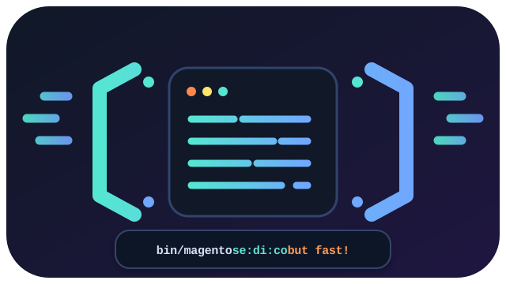

<p align="center">
  
</p>

<p align="center">
  <a href="https://github.com/speedupmate/magento2-spmt-fast-di-compile/actions/workflows/magento2-spmt-fast-di-compile.yml?query=branch%3Amain">
    
  </a>
  <a href="https://github.com/speedupmate/di-compiler/releases/latest">
    
  </a>
</p>

<h1 align="center">Magento 2 Fast DI Compile</h1>

<p align="center">Companion Magento module for <a href="https://github.com/speedupmate/di-compiler/">fast-di-compile</a>, a Rust replacement for <code>bin/magento setup:di:compile</code>.</p>

<p align="center">Keeps the normal Magento command name and uses the Rust compiler when a trusted <code>fast-di-compile</code> binary is available.</p>

## What it does

- Replaces Magento's `setup:di:compile` command loader entry with a fast-di-compile wrapper.
- Installs the package binary at `vendor/spmt/magento2-spmt-fast-di-compile/bin/fast-di-compile`.
- Falls back to the local development binary at `rust/di-compiler/target/release/fast-di-compile` if you build your binary on your own.
- Passes Magento's project root to the binary with `--magento-root`.
- Forwards supported fast-di-compile options from Magento CLI.
- Keeps forwarded path options to paths inside the Magento project root.
- Runs the fast-di-compile with a 15-second timeout and returns sanitized console output.
- Falls back to Magento's standard PHP compiler when the binary is missing, untrusted or you opt to skip.
- Provides `--standard` to run Magento's standard PHP compile.

## Get started

You need a running Magento installation and a `fast-di-compile` binary for your platform.

- Magento or Adobe Commerce. With this module installed and enabled.
- A Linux or macOS binary from [speedupmate/di-compiler releases](https://github.com/speedupmate/di-compiler/releases), or a locally built.

### 1. Installation

The package is installed with Composer :

```bash
composer require spmt/magento2-spmt-fast-di-compile
bin/magento setup:upgrade
```

The module source lives in `./src`.

### 2. Install the Rust compiler binary

On a fresh installation, Composer creates the installer proxy at `vendor/bin/install-fast-di-compile.php`. If this package was already installed before the installer was added, refresh its locked metadata first:

```bash
composer update spmt/magento2-spmt-fast-di-compile
```

Then install the latest platform binary into the package:

```bash
vendor/bin/install-fast-di-compile.php
```

The installer uses PHP ext-curl, which is already required by magento/framework. It detects Linux/macOS and x64/arm64 automatically, resolves the latest `speedupmate/di-compiler` GitHub release, reads each release asset's SHA-256 digest from the GitHub API, and downloads the matching archive plus `sha256sums.txt`. Then it is downloaded to:

```text
vendor/spmt/magento2-spmt-fast-di-compile/bin/fast-di-compile
```

If the Composer bin proxy is not available yet, run the package script directly:

```bash
vendor/spmt/magento2-spmt-fast-di-compile/bin/install-fast-di-compile.php
```

Useful installer options:

| Option | What it does |
| --- | --- |
| `--version v1.0.3` | Install a specific release tag instead of the latest release. Defaults to `SPMT_FAST_DI_COMPILE_VERSION` when that is set. |
| `--platform linux-arm64` | Override automatic platform detection. |
| `--force` | Replace a symlink or a binary that is not the selected release. |
| `--install-dir /path/to/bin` | Install into a custom directory. |

Installed binary is replaced when the selected release archive digest changes. A symlink, or a file that is not the selected release, stays in place unless `--force` is set. The verification file `fast-di-compile.release-stamp` only avoids a repeat download; anyone who can write the install directory can forge it, so regular risks on executing binaries downloaded from intenret is involved.

Release asset suffixes are:

| Platform | Asset suffix |
| --- | --- |
| Linux x64 | `linux-x64` |
| Linux arm64 | `linux-arm64` |
| macOS Intel | `macos-x64` |
| macOS Apple Silicon | `macos-arm64` |

### 3. Optional Composer automation

Composer only executes scripts declared in main composer.json. To install or update the binary automatically, merge these entries into the Magento project's root `composer.json`:

```json
{
    "scripts": {
        "install-fast-di-compile": [
            "@php vendor/spmt/magento2-spmt-fast-di-compile/bin/install-fast-di-compile.php"
        ],
        "post-install-cmd": [
            "@install-fast-di-compile"
        ],
        "post-update-cmd": [
            "@install-fast-di-compile"
        ]
    }
}
```

Keep any existing root scripts when merging this configuration. The installer runs after `composer install` and `composer update`; a download or verification failure stops the Composer command. Composer's `--no-scripts` option skips the automatic installation.

### 4. Compile your Magento project

Run the normal Magento command:

```bash
bin/magento setup:di:compile
```

If a installed binary exists, this module runs `fast-di-compile`.

To force Magento's standard PHP compiler use:

```bash
bin/magento setup:di:compile --standard
```

## Useful options

| Option | What it does |
| --- | --- |
| `--standard` | Run Magento's standard PHP compiler instead of the Rust compiler. |
| `--output var/tmp/fast-di-output` | Set the generated output folder. Must resolve inside the Magento project root. |
| `--jobs 8` | Set parallel workers. Accepted range is `1` through `256`. Sane number is core count -2 or -4 |
| `--fallback-php /usr/local/bin/php` | Set the PHP executable used by the Rust compiler for fallback reflection. Must resolve to the same PHP binary running Magento CLI. |
| `--incremental` | Enable incremental compilation. |
| `--dry-run` | Run without writing generated files. |
| `--validate` | Validate output against PHP ground truth. |
| `--php-generated generated` | Set the PHP ground-truth generated directory used with `--validate`. Must resolve inside the Magento project root. |
| `--compare-archive` | Compare generated output against an archive baseline. |
| `--archive-root var/tmp/magento-di-baseline` | Set the archive root containing `_code` and `_metadata`. Must resolve inside the Magento project root. |
| `--compare-report-dir var/tmp/fast-di-output/diff` | Set where archive diff reports are written. Must resolve inside the Magento project root. |
| `--compare-fail-on-diff` | Exit with failure when archive comparison finds differences. |
| `--ignore-constructor-integrity` | Continue when constructor integrity validation fails. |
| `-v`, `-vv`, `-vvv` | Forward verbose mode to the Rust compiler as `--verbose`. |

## How it works under the hood

Magento builds console commands through `Magento\Framework\Console\CommandLoader\Aggregate`.

This module registers a preference for that aggregate loader. When Magento asks for `setup:di:compile`, the module checks for an executable compiler binary in this order:

1. `BP/vendor/spmt/magento2-spmt-fast-di-compile/bin/fast-di-compile`
2. `BP/rust/di-compiler/target/release/fast-di-compile`

If a binary is available, the module returns a wrapper command named `setup:di:compile`. The binary must resolve inside `BP`, not symlinked, and its path components must not be writable by group or other users.

The wrapper runs the Rust binary with the canonical Magento root, sets Magento's root as the process working directory, passes the current Magento CLI PHP binary to `--fallback-php`, strips common secret-bearing environment variables, streams sanitized stdout and stderr back to Magento's console output, and returns Magento success or failure codes based on the Rust process exit code. The Rust process timeout is 15 seconds.

If no binary is available, the original Magento command loader handles the command unchanged.

## Debugging

This matches the fast-di-compile own debugging process. Start with verbose output:

```bash
bin/magento setup:di:compile -v
```

To compare Rust output with Magento's standard compiler, first create a baseline using Magento's compiler:

```bash
bin/magento setup:di:compile --standard
mkdir -p var/tmp/magento-di-baseline
cp -R generated/code var/tmp/magento-di-baseline/_code
cp -R generated/metadata var/tmp/magento-di-baseline/_metadata
```

Then run the Rust compiler through Magento and compare against the baseline:

```bash
bin/magento setup:di:compile \
  --output var/tmp/fast-di-output \
  --compare-archive \
  --archive-root var/tmp/magento-di-baseline
```

Reports are written to `var/tmp/fast-di-output/diff/` unless `--compare-report-dir` is provided.

For compiler internals and lower-level debugging notes, see [speedupmate/di-compiler](https://github.com/speedupmate/di-compiler/).

## Development

Module source is under `src/`.

Useful checks from the Magento installation root:

```bash
composer install
vendor/bin/phpunit --configuration phpunit.xml.dist
vendor/bin/phpcs --standard=Magento2 --extensions=php,xml ./src
vendor/bin/phpcbf --standard=Magento2 --extensions=php,xml ./src
xmllint --noout ./src/etc/di.xml
xmllint --noout ./src/etc/module.xml
```

The GitHub Actions workflow for this package runs PHPUnit inside Docker Official PHP Alpine images for PHP 8.3/Symfony 6.4, PHP 8.4/Symfony 6.4, and PHP 8.5/Symfony 7.4. It also runs Magento Coding Standard validation in `php:8.4-cli-alpine`.

From the Magento root, verify the module is enabled:

```bash
bin/magento module:status Spmt_FastDiCompile
```

## License and copyright

Copyright (c) 2026 Anton Siniorg.

This extension magento2-spmt-fast-di-compile is released under the [MIT License](LICENSE). Use it, improve it, and share it.
